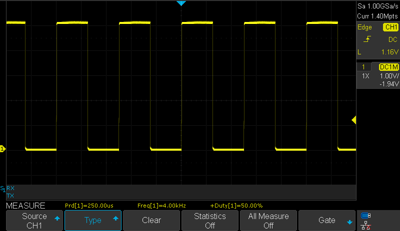
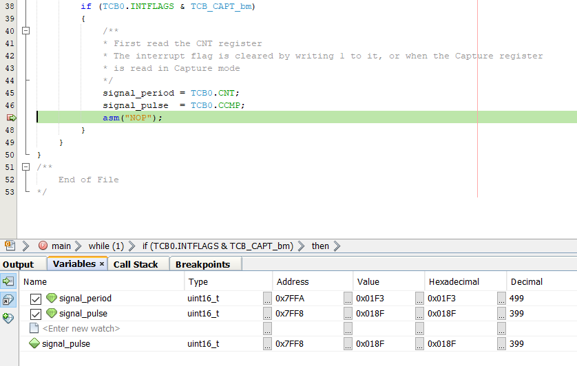

# Analog Signal Pulse Duration Measurement

This application shows an implementation of duration/frequency measurement for an analog input signal, with minimal usage of microcontroller power. It uses the Event System (EVSYS) to route the signals from the AC output through an Event Channel to Timer Counter B (TCB) Event Input. To do this, the Event System must be configured properly.
 
## Related Documentation
More details and code examples on the AVR128DA48 can be found at the following links:
- [TB3211 - Getting Started with Analog Comparator (AC)](http://ww1.microchip.com/downloads/en/Appnotes/TB3211-Getting-Started-with-AC-90003211A.pdf)
- [AVR128DA48 Product Page](https://www.microchip.com/wwwproducts/en/AVR128DA48)
- [AVR128DA48 Code Examples on GitHub](https://github.com/microchip-pic-avr-examples?q=avr128da48)
- [AVR128DA48 Project Examples in START](https://start.atmel.com/#examples/AVR128DA48CuriosityNano)

## Software Used
- MPLAB® X IDE 5.40 or newer [(microchip.com/mplab/mplab-x-ide)](http://www.microchip.com/mplab/mplab-x-ide)
- MPLAB® XC8 2.30 or a newer compiler [(microchip.com/mplab/compilers)](http://www.microchip.com/mplab/compilers)
- MPLAB® Code Configurator (MCC) 4.0.1 or newer [(microchip.com/mplab/mplab-code-configurator)](https://www.microchip.com/mplab/mplab-code-configurator)
- MPLAB® Code Configurator (MCC) Device Libraries 8-bit AVR MCUs 2.5.0 or newer [(microchip.com/mplab/mplab-code-configurator)](https://www.microchip.com/mplab/mplab-code-configurator)
- AVR-Dx_DFP 1.6.88 or newer Device Pack

## Hardware Used
- AVR128DA48 Curiosity Nano [(DM164151)](https://www.microchip.com/Developmenttools/ProductDetails/DM164151)

## Setup
The AVR128DA48 Curiosity Nano Development Board is used as test platform.

 

The following configurations must be made for this project:

- CPU clock frequency is 4 MHz
- Configure PD2 as analog input and PA7 as digital output
- VREF
  - AC0 voltage reference at 2.048V
  - AC0 voltage reference enabled
- AC0
  - Positive input - pin 0
  - Negative input - DAC voltage reference is used for the negative input
  - DAC reference for the negative input is 1.024V
  - AC0 enabled
  - AC0 output enabled
- TCB0
  - Input Capture Frequency and Pulse-Width Measurement mode
  - Prescaler CLK_PER/2
  - Run Standby: enabled
- Event System
  - Analog Comparator 0 output linked to Event Channel 0
  - TCB uses Event Channel 0

 |Pin                       | Configuration       |
 | :---------------------:  | :----------------:  |
 |            PD2           |   AC input          |
 |            PA7           |   AC output         |

 ## Operation
 1. Connect the board to the PC.

 2. Open the Analog_Signal_Pulse_Duration_Measurement.X project in MPLAB® X IDE.

 3. Set the Analog_Signal_Pulse_Duration_Measurement.X project as main project. Right click the project in the **Projects** tab and click **Set as Main Project**.

  

 4. Clean and build the Analog_Signal_Pulse_Duration_Measurement.X project. Right click on the **Analog_Signal_Pulse_Duration_Measurement.X** project and select **Clean and Build**. 

  

 5. Select the **AVR128DA48 Curiosity Nano** in the Connected Hardware Tool section of the project settings:
- Right click on the project and click **Properties**
- Click on the arrow under the Connected Hardware Tool
- Select the **AVR128DA48 Curiosity Nano** (click on the **SN**), click **Apply** and then click **OK**:

 

 6.  Program the project to the board. Right click on the project and click **Make and Program Device**.

 

## Demo

The application will be able to measure the input signal pulse and period, and the AC will provide an output signal that switches when the input signal crosses the voltage reference.

To visualize the `signal_period` and `signal_pulse` variables values, the user must add the following instruction at the end of the `if` statement:

`   asm("NOP");`

Then, the user can enable a breakpoint on this line and visualize the signal period and the signal pulse inside the Variables window.

 The image below presents the Analog Comparator output signal for a square input signal. 
 

To visualize the results inside the `signal_period` and `signal_pulse` variables, enable a breakpoint on the `asm("NOP");` code line. Then, click on the **Debug Main Project** button, as presented below.
 

 The image below presents the resulting values when generating a 50% duty cycle square signal on the AC input.
 

 The input signal (green) and the output signal (yellow) are presented in the oscilloscope capture below.
 

 The values for a 20% duty cycle signal provided on the AC input, measured using the timer, are presented below.
 
 The input signal (green) and the output signal (yellow) are presented in the oscilloscope capture below.
 

 The values for a 80% duty cycle signal provided on the AC input, measured using the timer, are presented below.
 
 The input signal (green) and the output signal (yellow) are presented in the oscilloscope capture below.
 

 For a triangular input signal, the oscilloscope capture is presented below. The triangular waveform is used to determine the threshold of the Analog Comparator, the value of the input voltage for which the output signal switches.
 
 The voltage reference selected for the DAC (1.024V) on the negative input of the AC can be observed in the image below. The AC output goes high/low when the input voltage crosses ~1.024V.
 

## Summary

This project shows how to use the AC in conjunction with other peripherals such as VREF, DAC, EVSYS, and TCB to measure the period and pulse width of an analog input signal.
