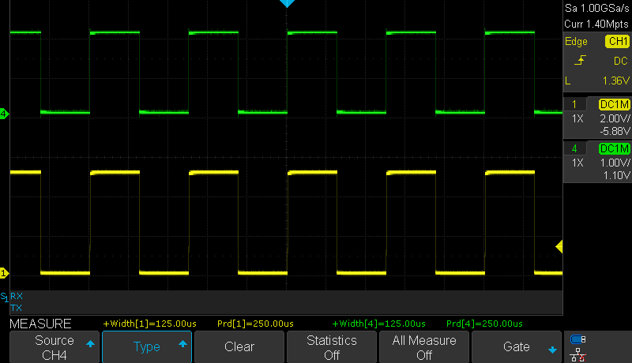

# Level Crossing Detector

This example shows a basic initialization and setup for the AC peripheral. The application monitors an analog input signal, compares it to a fixed voltage and notifies the user via interrupt and an output pin every time the input signal crosses the fixed voltage level.
The comparator can be used to monitor battery voltage (or any other DC level).

## Related Documentation
More details and code examples on the AVR128DA48 can be found at the following links:
- [TB3211 - Getting Started with Analog Comparator (AC)](http://ww1.microchip.com/downloads/en/Appnotes/TB3211-Getting-Started-with-AC-90003211A.pdf)
- [AVR128DA48 Product Page](https://www.microchip.com/wwwproducts/en/AVR128DA48)
- [AVR128DA48 Code Examples on GitHub](https://github.com/microchip-pic-avr-examples?q=avr128da48)
- [AVR128DA48 Project Examples in START](https://start.atmel.com/#examples/AVR128DA48CuriosityNano)

## Software Used
- MPLAB® X IDE 5.40 or newer [(microchip.com/mplab/mplab-x-ide)](http://www.microchip.com/mplab/mplab-x-ide)
- MPLAB® XC8 2.30 or a newer compiler [(microchip.com/mplab/compilers)](http://www.microchip.com/mplab/compilers)
- MPLAB® Code Configurator (MCC) 4.0.1 or newer [(microchip.com/mplab/mplab-code-configurator)](https://www.microchip.com/mplab/mplab-code-configurator)
- MPLAB® Code Configurator (MCC) Device Libraries 8-bit AVR MCUs 2.5.0 or newer [(microchip.com/mplab/mplab-code-configurator)](https://www.microchip.com/mplab/mplab-code-configurator)
- AVR-Dx_DFP 1.6.88 or newer Device Pack

## Hardware Used
- AVR128DA48 Curiosity Nano [(DM164151)](https://www.microchip.com/Developmenttools/ProductDetails/DM164151)

## Setup
The AVR128DA48 Curiosity Nano Development Board is used as test platform.

 

The following configurations must be made for this project:

- CPU clock frequency is 4 MHz
- Configure PD2 as analog input and PA7 as digital output
- VREF
  - AC0 voltage reference at 2.048V
  - AC0 voltage reference enabled
- AC0
  - Positive input - pin 0
  - Negative input - DAC voltage reference is used for the negative input
  - DAC reference for the negative input is 1.024V
  - AC0 enabled
  - AC0 output enabled

 |Pin                       | Configuration      |
 | :---------------------:  | :----------------: |
 |            PA7           |   AC Output        |
 |            PD2           |   AC Input         |

 ## Operation
 1. Connect the board to the PC.

 2. Open the Level_Crossing_Detector.X project in MPLAB® X IDE.

 3. Set the Level_Crossing_Detector.X project as main project. Right click the project in the **Projects** tab and click **Set as Main Project**.

  

 4. Clean and build the Level_Crossing_Detector.X project. Right click on the **Level_Crossing_Detector.X** project and select **Clean and Build**. 

  

 5. Select the **AVR128DA48 Curiosity Nano** in the Connected Hardware Tool section of the project settings:
- Right click on the project and click **Properties**;
- Click on the arrow under the Connected Hardware Tool;
- Select the **AVR128DA48 Curiosity Nano** (click on the **SN**), click **Apply** and then click **OK**:

 

 6.  Program the project to the board. Right click on the project and click **Make and Program Device**.

 

## Demo

In this demo, the AC output will go high (5V) when the input signal is above the threshold and low (0V) when the input signal is below the threshold. In the following pictures, the green signal is the input signal and the yellow signal is the output of the AC.

 Input: Sine wave
 

 Input: Triangle wave
 

 Input: Square wave (20% duty cycle)
 

 Input: Square wave (50% duty cycle)
 

 Input: Square wave (80% duty cycle)
 

The output signal value is toggled each time a transition through 1.024V on the input signal is detected. This can be observed in the image below.

 

## Summary

This project illustrated a basic configuration for the AC peripheral. The application monitors an analog input signal and compares it to a fixed voltage. An interrupt is triggered and a pin is toggled every time the input signal crosses the fixed voltage level.
