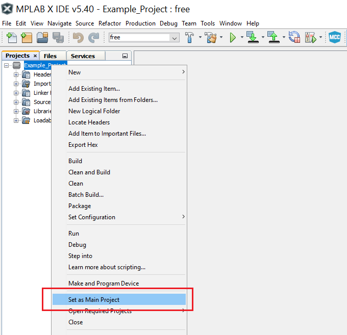

# Preventing False Spike Detection

This example demonstrates the hysteresis features of the AC module that helps to avoid the frequent toggling of the AC when the positive input oscillates very close to the negative input level.  
This application is based on the [Level Crossing Detector](../Level_Crossing_Detector) application and, additionally, it has the Hysteresis mode enabled.

## Related Documentation
More details and code examples on the AVR128DA48 can be found at the following links:
- [TB3211 - Getting Started with Analog Comparator (AC)](http://ww1.microchip.com/downloads/en/Appnotes/TB3211-Getting-Started-with-AC-90003211A.pdf)
- [AVR128DA48 Product Page](https://www.microchip.com/wwwproducts/en/AVR128DA48)
- [AVR128DA48 Code Examples on GitHub](https://github.com/microchip-pic-avr-examples?q=avr128da48)
- [AVR128DA48 Project Examples in START](https://start.atmel.com/#examples/AVR128DA48CuriosityNano)

## Software Used
- MPLAB® X IDE 5.40 or newer [(microchip.com/mplab/mplab-x-ide)](http://www.microchip.com/mplab/mplab-x-ide)
- MPLAB® XC8 2.30 or a newer compiler [(microchip.com/mplab/compilers)](http://www.microchip.com/mplab/compilers)
- MPLAB® Code Configurator (MCC) 4.0.1 or newer [(microchip.com/mplab/mplab-code-configurator)](https://www.microchip.com/mplab/mplab-code-configurator)
- MPLAB® Code Configurator (MCC) Device Libraries 8-bit AVR MCUs 2.5.0 or newer [(microchip.com/mplab/mplab-code-configurator)](https://www.microchip.com/mplab/mplab-code-configurator)
- AVR-Dx_DFP 1.6.88 or newer Device Pack

## Hardware Used
- AVR128DA48 Curiosity Nano [(DM164151)](https://www.microchip.com/Developmenttools/ProductDetails/DM164151)

## Setup
The AVR128DA48 Curiosity Nano Development Board is used as test platform.

 

The following configurations must be made for this project:

- CPU clock frequency is 4 MHz
- Configure PD2 as analog input and PA7 as digital output
- VREF
  - AC0 voltage reference at 2.048V
  - AC0 voltage reference enabled
- AC0
  - Positive input - pin 0
  - Negative input - DAC voltage reference is used for the negative input
  - DAC reference for the negative input is 1.024V
  - Enable hysteresis at 25 mV
  - AC0 enabled
  - AC0 output enabled

 |Pin                       | Configuration       |
 | :---------------------:  | :----------------:  |
 |            PD2           |   AC input          |
 |            PA7           |   AC output         |

 ## Operation
 1. Connect the board to the PC.

 2. Open the Preventing_False_Spike_Detection.X project in MPLAB® X IDE.

 3. Set the Preventing_False_Spike_Detection.X project as main project. Right click the project in the **Projects** tab and click **Set as Main Project**.

  

 4. Clean and build the Preventing_False_Spike_Detection.X project. Right click on the **Preventing_False_Spike_Detection.X** project and select **Clean and Build**. 

  

 5. Select the **AVR128DA48 Curiosity Nano** in the Connected Hardware Tool section of the project settings:
- Right click on the project and click **Properties**;
- Click on the arrow under the Connected Hardware Tool;
- Select the **AVR128DA48 Curiosity Nano** (click on the **SN**), click **Apply** and then click **OK**:

 

 6.  Program the project to the board. Right click on the project and click **Make and Program Device**.

 

## Demo

This application shows the implementation of hysteresis in a voltage level detector application. 

The figure below presents both input (green) and output (yellow) signals of this application. There is no noticeable difference between the signals displayed here (with a 25 mV hysteresis enabled), and the signals provided for the basic Level Crossing Detector. To observe the differences, the user must zoom in to visualize the rising/falling edges of the signals.

 

A comparison between the without-hysteresis application and with-hysteresis application signals is presented below.

 The image below shows the AC configuration without the hysteresis activated, resulting in a spike on the output signal. When the input signal (green) oscillates around the threshold value of the AC, the output signal (yellow) will switch more often than it should, generating spikes.
 

 The image below shows the AC configuration with the hysteresis activated, preventing the unwanted spikes on the output signal. Again, the input signal (green) oscillates around the threshold, but there are no spikes generated on the output (yellow).
 

## Summary

This project shows how to use the hysteresis when building a voltage level detector application using the AC.
